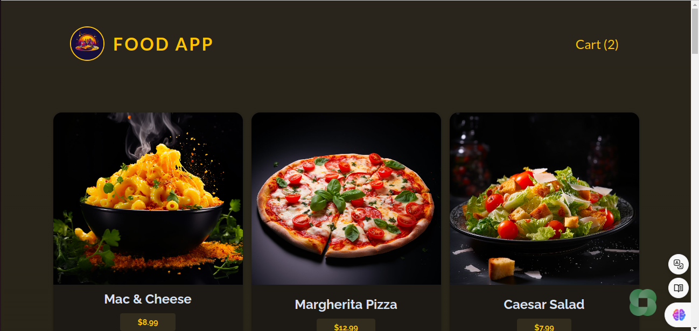
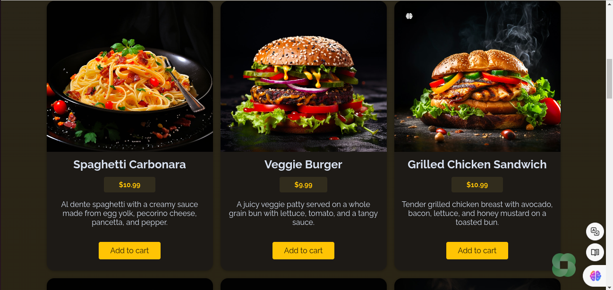
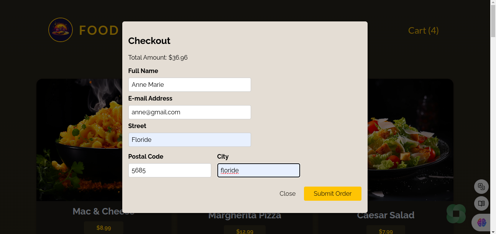
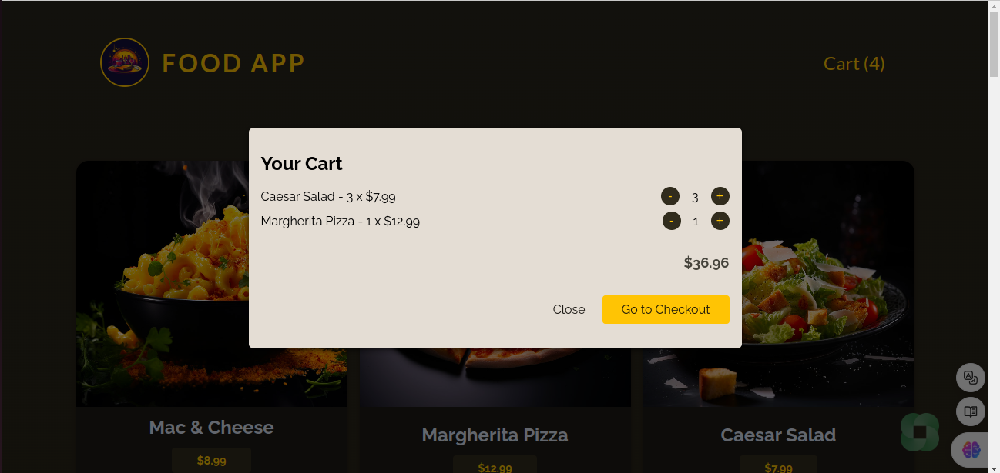
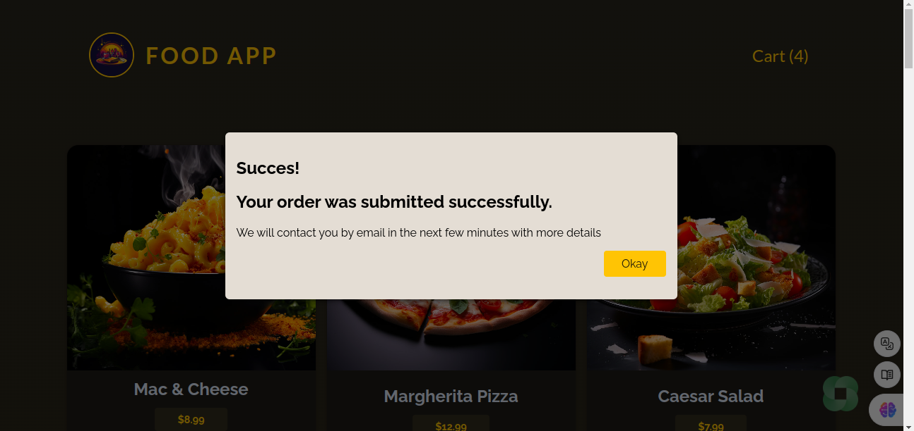

# Food App

A full-stack food ordering application that allows users to browse available meals, add them to a cart, and place orders. The backend is built with Node.js and Express, while the frontend is developed using React, leveraging modern hooks and context for state management.








# Project Description

Food App is a web application designed to provide users with a seamless experience for browsing meals, managing their shopping cart, and placing orders. The application features a responsive frontend built with React, which interacts with a robust backend powered by Node.js and Express. Data is managed using JSON files, ensuring simplicity and ease of access.

# Technologies Used

## Backend

- **Node.js:** JavaScript runtime environment.

- **Express.js:** Fast, unopinionated, minimalist web framework for Node.js.

- **Body-Parser:** Middleware to parse incoming request bodies.

- **Node File System (fs/promises):** For handling file operations asynchronously.

- **JSON:** Data storage format for meals and orders.

## Frontend

- **React:** JavaScript library for building user interfaces.

- **React Hooks:** useState, useEffect, useContext, useReducer, useCallback.

- **Context API:** For managing global state (CartContext, UserProgressContext).

- **Custom Hooks:** useHttp for handling HTTP requests.

- **JavaScript (ES6+):** Modern JavaScript features.

- **CSS:** Styling the application.

## Features

- **Browse Meals:** View a list of available meals fetched from the backend.

- **Add to Cart:** Add meals to the shopping cart with adjustable quantities.

- **View Cart:** Access the cart through a modal interface, displaying selected items and total cost.

- **Checkout Process:** Fill in customer details and submit orders.

- **Order Management:** Backend validates and stores orders in a JSON file.

- **Error Handling:** Graceful handling of loading states and errors during data fetching and order submission.

- **Responsive Design:** Ensures a seamless experience across various devices.

# Installation

## Prerequisites

- **Node.js** (v14 or later)
- **Vite**
- **npm** (v6 or later)

Ensure you have Node.js and npm installed on your machine. You can download them from Node.js official website.

## Backend Setup

**1. Clone the Repository:**
```
git clone https://github.com/Lyrecoph/food-app.git
```

**2. Navigate to the Backend Directory:**
```
cd food-app/backend
```

**3. Install Dependencies:**
```
npm install
```

**4. Start the Backend Server:**
```
npm start
```

The backend server will start on `http://localhost:3000.`

## Frontend Setup

**1. Open a New Terminal Window and Navigate to the Frontend Directory:**
```
cd food-app/frontend
```

**2. Install Dependencies:**
```
npm install
```

**3. Start the Frontend Application:**
```
npm run dev
```

The frontend will typically run on `http://localhost:5173` or another available port to avoid conflict with the backend.

# Usage

**1. Access the Application:**

Open your browser and navigate to `http://localhost:5135`.

**2. Browse and Order Meals:**

- Browse the list of available meals.

- Add desired meals to your cart.

- View your cart by clicking the cart button in the header.

- Proceed to checkout to submit your order.

- Fill in the required customer details and submit the order.

- Receive confirmation upon successful order submission.

# API Endpoints

## GET `/meals`

Retrieve the list of available meals.

- **URL:** `/meals`

- **Method:** `GET`

- **Response:**
```
[
  {
    "id": "m1",
    "name": "Mac & Cheese",
    "price": "8.99",
    "description": "Creamy cheddar cheese mixed with perfectly cooked macaroni, topped with crispy breadcrumbs. A classic comfort food.",
    "image": "images/mac-and-cheese.jpg"
  },
  {
    "id": "m2",
    "name": "Margherita Pizza",
    "price": "12.99",
    "description": "A classic pizza with fresh mozzarella, tomatoes, and basil on a thin and crispy crust.",
    "image": "images/margherita-pizza.jpg"
  }
  // ... more meals
]

```

## POST `/orders`

Submit a new order.

- **URL:** /orders

- **Method:** POST

- **Headers:**

    - **Content-Type:** application/json

- **Body:**
```
{
  "order": {
    "items": [
      {
        "id": "m1",
        "name": "Mac & Cheese",
        "price": "8.99",
        "quantity": 2
      }
      // ... more items
    ],
    "customer": {
      "name": "John Doe",
      "email": "john@example.com",
      "street": "123 Main St",
      "postal-code": "12345",
      "city": "New York"
    }
  }
}
```

- **Success Response:**

    - **Status:** `201 Created`

    - **Body:**
    ```
    {
        "message": "Order created!"
    }
    ```
- **Error Responses:**

    - **Status:** 400 Bad Request

    - **Body:**
    ```
    {
        "message": "Order created!"
    }

    ```

# Project Structure

## Backend

```
backend/
├── app.js
├── data/
│   ├── available-meals.json
│   └── orders.json
├── public/
│   └── images/
│       ├── mac-and-cheese.jpg
│       └── margherita-pizza.jpg
├── package.json
└── package-lock.json
```

- **app.js:** Main server file handling API endpoints and server configurations.

- **data/:** Contains JSON files for available meals and orders.

- **public/:** Serves static assets like images.

- **package.json:**Lists dependencies and scripts.

## Frontend

```
frontend/
├── public/
│   ├── index.html
│   └── modal.html
├── src/
│   ├── components/
│   │   ├── Cart.jsx
│   │   ├── CartItem.jsx
│   │   ├── Checkout.jsx
│   │   ├── Header.jsx
│   │   ├── MealItem.jsx
│   │   ├── Meals.jsx
│   │   ├── UI/
│   │   │   ├── Button.jsx
│   │   │   ├── Input.jsx
│   │   │   └── Modal.jsx
│   │   ├── store/
│   │   │   ├── cartContext.jsx
│   │   │   └── userProgressContext.jsx
│   │   └── Error.jsx
│   ├── hooks/
│   │   └── useHttp.js
│   ├── util/
│   │   └── formatting.js
│   ├── App.jsx
│   └── index.js
├── package.json
└── package-lock.json
```

**components/:** Contains all React components, organized into subdirectories for UI elements and state management.

**hooks/:** Custom hooks for handling HTTP requests and other logic.

**util/:** Utility functions, such as currency formatting.

**App.jsx:** Root component that integrates all parts of the application.

**index.js:** Entry point for the React application.

# License

This project is licensed under the MIT License.
